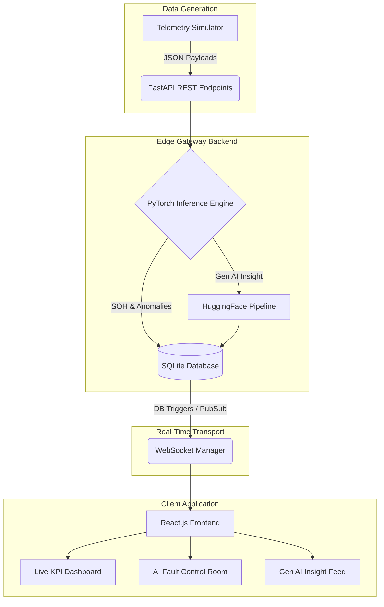
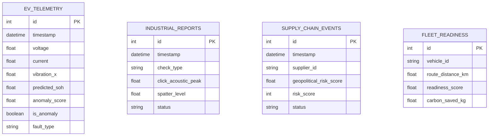

# EdgeIntel-AM: AI for Industrial EV Supply Chain & Asset Intelligence


---

## Project Overview
As the world transitions to electric vehicles (EVs) in industrial and commercial sectors, operators face two major hurdles: managing the predictive maintenance of complex battery and motor systems, and navigating a highly volatile, geopolitical supply chain for critical minerals.

**EdgeIntel-AM** is a comprehensive, Agentic AI platform built for the Net Zero Hackathon. It solves these challenges by fusing **Deep Learning (PyTorch)** with **Generative AI (HuggingFace Transformers)**. It ingests high-frequency telemetry from fleets, factory floors, and supply chain nodes, utilizing real-time neural networks to predict anomalies and a GenAI Agent to instantly generate human-readable mitigation strategies.

---

## Key Features
*   **EV Asset Performance Management (APM):** PyTorch models monitor battery state-of-health and detect mechanical anomalies via 3-axis motor vibration deep autoencoders.
*   **Fleet Electrification Readiness:** Deep Learning regressor scores heavy-duty diesel vehicles on a 0-100 scale to prioritize EV transition and maximize ROI.
*   **Supply Chain Risk Agent:** Evaluates global supplier nodes based on geopolitical scores and defect rates. A GenAI Agent broadcasts real-time mitigation strategies during shocks.
*   **Manufacturing Quality Intelligence:** Predicts quality drift before defective products reach assembly (Wire Harness Acoustic Profiling & Weld Electrode Health).
*   **Net Zero Carbon Tracker:** Live carbon offset tracking (diesel emissions avoided) integrated directly into the dashboard.
*   **AI Fault Control Room:** Interactive UI panel to inject realistic physical and geopolitical faults into the simulation data stream for demo purposes.

---

## Tech Stack
- **AI/ML Layer:** PyTorch, HuggingFace Transformers (GenAI `distilgpt2`), Scikit-Learn (Scaling/Metrics)
- **Backend Edge Gateway:** Python, FastAPI, Uvicorn, WebSockets, SQLAlchemy (SQLite)
- **Frontend Dashboard:** React 18, Vite, Recharts, Lucide Icons, Vanilla CSS (Glassmorphism)
- **3D Visualization:** Blender Python API (`bpy`)

---

## Project Structure
```text
Hackton/
├── backend/
│   ├── database.py       # SQLAlchemy setup and SQLite connection
│   ├── main.py           # FastAPI app, endpoints, WebSockets, GenAI inference
│   ├── models.py         # DB schema definitions
│   ├── simulator.py      # Generates continuous synthetic telemetry
│   └── train_models.py   # PyTorch model architecture and training loops
├── frontend/
│   ├── src/
│   │   ├── App.jsx       # Main React dashboard and WebSocket client
│   │   ├── index.css     # UI styling (neon palettes, glassmorphism)
│   │   └── main.jsx      # React entry point
│   └── package.json      # Node dependencies
├── models/               # Saved PyTorch .pth files and Scikit .pkl scalers
├── blender_visualization.py # Programmatic 3D architecture generator
├── start.bat             # 1-click Windows bootloader
└── requirements.txt      # Python dependencies
```

---

## Database Schema
The system uses SQLite via SQLAlchemy. The primary tables include:
*   `ev_telemetry`: Stores high-frequency voltage, current, temp, and vibration data, along with PyTorch anomaly scores.
*   `industrial_reports`: Logs manufacturing quality checks (acoustic peaks for wire harnesses, current/spatter for weld electrodes).
*   `supply_chain_events`: Tracks supplier risk metrics (geopolitical risk, scarcity, lead times).
*   `fleet_readiness`: Logs vehicle duty cycles, payload, and the computed EV transition readiness score.

---

## Architecture Diagram


*(A 3D version of this architecture can be generated by running `blender_visualization.py` in Blender).*

---

## Application Workflow
1. **Simulation:** `simulator.py` generates varied standard-distribution data representing normal operations.
2. **Ingestion:** Data is sent via POST requests to the FastAPI backend.
3. **Inference:** FastAPI scales the data, converts it to PyTorch tensors, and runs it through the pre-trained neural networks.
4. **Agentic Reaction:** If an anomaly is detected, the data context is passed to the HuggingFace GenAI pipeline to synthesize a mitigation strategy.
5. **Broadcast:** Data and insights are saved to SQLite and immediately broadcasted to all connected web clients via WebSockets.

---

## ERD Diagram



---

## REST API Flow
The backend operates primarily on an ingestion-to-broadcast flow:
1. IoT edge devices (represented by the Simulator) send JSON payloads to `POST /api/telemetry/*`.
2. The endpoint blocks momentarily to perform PyTorch inference.
3. The record is committed to the database.
4. The `WebSocketManager` is triggered, serializing the new row and pushing it out to the React frontend `ws://` connection.

---

## Data Flow: Add Telemetry
When a new EV telemetry point is added:
1. `simulator.py` POSTs `{ voltage: 3.8, current: 1.5, ... }`
2. Backend standardizes using `ev_soh_model_scaler.pkl`.
3. Feedforward network (`ev_soh_model.pth`) predicts State of Health.
4. Deep Autoencoder (`ev_motor_anomaly_model.pth`) calculates MSE reconstruction loss for vibrations.
5. Record saved, WebSocket emitted.

---

## Data Flow: Fleet Tracking
For fleet transition readiness:
1. `simulator.py` POSTs vehicle route distance, payload tons, and duty cycle hours.
2. The PyTorch regressor evaluates the physical constraints against EV battery capabilities.
3. A Readiness Score (0-100) is generated.
4. Theoretical diesel carbon emissions avoided are calculated and added to the global NetZero KPI.

---

## Risk Alert Logic
Alerts are triggered dynamically based on PyTorch outputs rather than hardcoded thresholds:
*   **Mechanical Alerts:** Triggered when the motor vibration Autoencoder's Mean Squared Error (MSE) exceeds the max MSE observed during normal training data.
*   **Supply Chain Alerts:** Triggered when the Classification MLP outputs a `1` (High Risk) based on the combined weighted matrix of geopolitical scores and defect rates.
*   **GenAI Trigger:** Any time a `1` or anomaly threshold is breached, the HuggingFace agent is invoked to provide human-readable context and solutions to the frontend.

---

## Application Screens
The React dashboard features a unified view with multiple components:
1. **Global KPIs:** Top banner showing active carbon avoidance, risk factors, and overall yields.
2. **Main Tabs:** 
   * **EV Asset Performance:** Live charts for SoH, Voltage, and Anomaly Scores.
   * **Supply Chain Risk:** Bar charts comparing supplier geopolitical risks vs defect rates.
   * **QMS Manufacturing:** Real-time acoustic frequency scatter plots for wire harnesses.
   * **Fleet Electrification:** Bar charts displaying fleet readiness scores.
3. **AI Fault Control Room:** A side-panel allowing users to artificially inject faults (e.g., "Motor Bearing Failure", "Lithium Shortage") to watch the AI react.
4. **GenAI Insight Feed:** A terminal-like window displaying real-time text advisories from the HuggingFace agent.

---

## Full API Reference

### Telemetry Ingestion
*   `POST /api/telemetry/ev`: Ingests voltage, temperature, and vibration. Returns `predicted_soh` and `anomaly_score`.
*   `POST /api/telemetry/industrial`: Ingests wire harness acoustic data or weld electrode spatter data.
*   `POST /api/telemetry/supply_chain`: Ingests supplier metrics and evaluates risk.
*   `POST /api/telemetry/fleet`: Ingests fleet duty cycles and outputs readiness scores.

### Data Retrieval
*   `GET /api/history/{domain}`: Retrieves the last `N` records for charting. Domains: `ev`, `industrial`, `supply_chain`, `fleet`.
*   `GET /api/stats`: Returns aggregated KPIs for the top dashboard banner (e.g., `total_carbon_saved_kg`).

### Simulation Control
*   `POST /api/fault/inject`: Sets specific global fault states (used by the Control Room UI).
*   `POST /api/fault/clear`: Resets all simulated faults back to normal.
*   `GET /api/fault/states`: Polled by `simulator.py` to know what type of synthetic data to generate.

---

## Getting Started

### Prerequisites
*   Python 3.9+
*   Node.js v16+
*   Git

### 1-Click Launch (Windows)
We have provided a convenient batch script that handles the entire setup.

1. Clone the repository:
   ```bash
   git clone https://github.com/thrinadh2005/Hackton.git
   cd Hackton
   ```
2. Run the startup script:
   ```powershell
   ./start.bat
   ```
3. The script will open three terminal windows. *Note: The very first run will take a few minutes as it trains the PyTorch models and downloads the HuggingFace AI weights (~500MB).*
4. Your browser will automatically open to `http://localhost:5173`.

---

## 🎯 Hackathon Problem Statement 

This platform implements all 5 core themes required by the hackathon:

### 1. EV Asset Performance Management (APM) Agent
*   **Requirement:** Monitor battery state-of-health, thermal events, generate predictive maintenance triggers.
*   **Implementation:** A PyTorch `TabularMLP` predicts Battery SOH degradation based on voltage, current, and temperature. A PyTorch `Deep Autoencoder` constantly analyzes 3-axis motor vibrations to detect mechanical anomalies in real-time.

### 2. Fleet Electrification Readiness & Procurement Intelligence
*   **Requirement:** Analyze route, payload, and duty cycles to generate a transition readiness index.
*   **Implementation:** A Deep Learning regressor ingests fleet telemetry and outputs a 0-100 `Readiness Score`, helping organizations prioritize which heavy-duty diesel vehicles to replace with EVs first to maximize ROI and carbon reduction.

### 3. EV Supply Chain Risk & Traceability Agent
*   **Requirement:** Track critical battery materials, flag geopolitical exposure and supplier risk.
*   **Implementation:** Evaluates global supplier nodes based on geopolitical scores, material scarcity, defect rates, and lead times. A **Gen AI (LLM) Agent** interprets these supply chain shocks and broadcasts real-time mitigation strategies to the dashboard.

### 4. Manufacturing Quality Intelligence (QMS Integration)
*   **Requirement:** Detect quality drift before defective product reaches assembly.
*   **Implementation:** 
    *   **Wire Harness Acoustic Profiling:** AI evaluates connector seating via acoustic frequency and vision confidence.
    *   **Weld Electrode Health Tracking:** Predicts remaining electrode life based on welding current and spatter index, stopping production before bad welds occur.

### 5. Net Zero Progress & Carbon Intelligence Tracker
*   **Requirement:** Track fleet electrification progress and quantify Scope 1 and Scope 3 emission reductions.
*   **Implementation:** Live carbon offset tracking (diesel emissions avoided) is integrated directly into the React Dashboard's top KPI bar.

---
## Seed Data
Because industrial EV and supply chain data is highly proprietary, this project relies on `backend/simulator.py` to act as the seed data generator. It continuously streams high-variance synthetic data modeled after real-world physics and logistics distributions, ensuring the dashboard is always alive and interactive.

---

## Development Notes
*   **PyTorch Training:** The models are re-trained locally every time `start.bat` is run (taking ~10 seconds). You can modify the architecture in `backend/train_models.py` and immediately see the results on next boot.
*   **HuggingFace Cache:** The `distilgpt2` model is downloaded to your local `~/.cache/huggingface` directory on first run to ensure offline capability thereafter.

---

## Future Enhancements
*   **Distributed Edge Deployment:** Moving the PyTorch inference directly onto Raspberry Pi / Nvidia Jetson devices via ONNX, sending only the resulting anomalies to the cloud.
*   **ERP Integration:** Connecting the Supply Chain API directly to live SAP or Oracle ERP instances for real-time geopolitical risk weighting.
*   **3D WebGL Digital Twin:** Exporting the programmatic Blender architecture into a Three.js canvas directly inside the React dashboard for spatial anomaly tracking.
