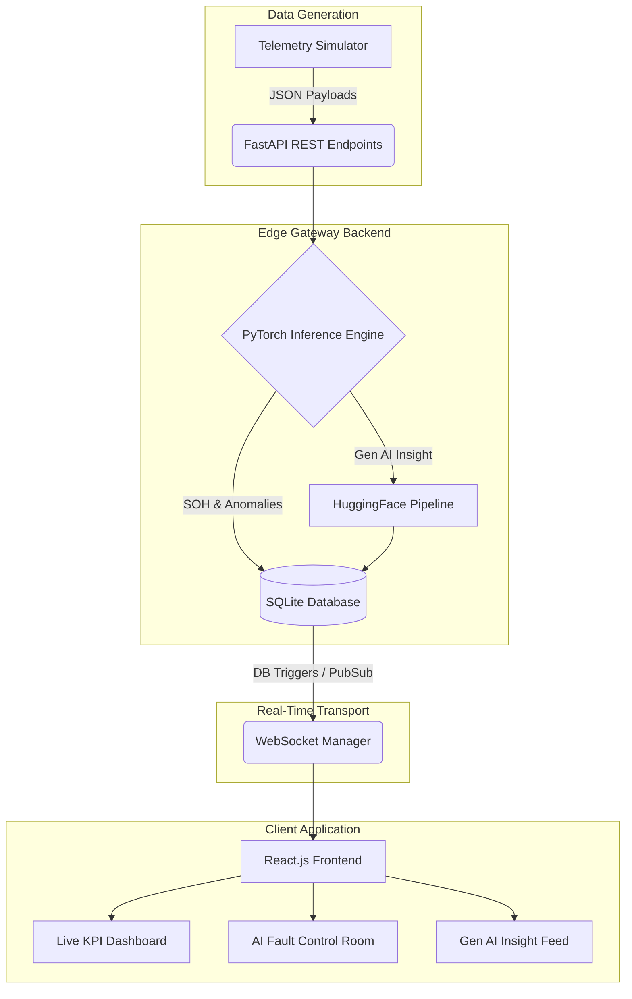
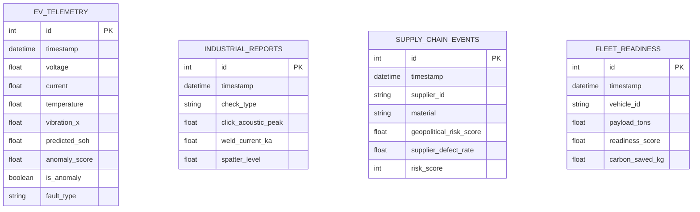

# EdgeIntel-AM: AI for Industrial EV Supply Chain & Asset Intelligence


---

## Project Overview
**EdgeIntel-AM** is an Agentic AI platform built for the Net Zero Hackathon. It addresses the industrial EV transition bottleneck by providing a unified AI layer that handles both operational asset performance (APM) and critical supply chain visibility. By fusing Deep Learning (PyTorch) with Generative AI (HuggingFace Transformers), it ingests high-frequency telemetry from fleets, factory floors, and supply chain nodes to predict anomalies and instantly generate human-readable mitigation strategies.

## Key Features
*   **EV Asset Performance Management (APM):** Predicts Battery SOH degradation (PyTorch TabularMLP) and detects mechanical motor anomalies via 3-axis vibration reconstruction (PyTorch Deep Autoencoder).
*   **Supply Chain Risk & Traceability:** Evaluates global supplier nodes based on geopolitical scores, material scarcity, defect rates, and lead times.
*   **Manufacturing Quality Intelligence (QMS):** Acoustic profiling of wire harnesses and predictive health tracking of weld electrodes.
*   **Fleet Electrification Readiness:** Deep Learning regressor outputs a transition readiness score to prioritize heavy-duty diesel replacements.
*   **Generative AI Agent:** HuggingFace `distilgpt2` NLP pipeline interprets PyTorch anomalies and broadcasts real-time mitigation strategies.
*   **Interactive Control Room:** A simulated dashboard environment to inject real-world faults and observe the AI's reaction.

## Tech Stack
*   **AI/ML Layer:** PyTorch, HuggingFace Transformers (GenAI), Scikit-Learn
*   **Backend Edge Gateway:** FastAPI, Uvicorn, WebSockets, SQLAlchemy
*   **Database:** SQLite (`app.db`)
*   **Frontend Dashboard:** React, Vite, Recharts, Lucide Icons, Vanilla CSS
*   **3D Visualization:** Blender Python API (`bpy`)

## Project Structure
```text
Hackton/
├── backend/
│   ├── main.py            # FastAPI server & WebSocket manager
│   ├── database.py        # SQLAlchemy engine & Base
│   ├── models.py          # SQLAlchemy ORM schemas
│   ├── simulator.py       # High-frequency IoT data generator
│   └── train_models.py    # PyTorch deep learning training loops
├── frontend/
│   ├── src/
│   │   ├── App.jsx        # Main React dashboard & WebSocket client
│   │   ├── index.css      # Custom neon/glassmorphism UI styles
│   │   └── main.jsx       # React DOM entry
│   ├── package.json       # Node dependencies
│   └── vite.config.js     # Vite bundler config
├── models/                # Serialized PyTorch weights (.pth) & Scalers (.pkl)
├── blender_visualization.py # Programmatic 3D architecture generator
├── start.bat              # Windows 1-click startup script
└── README.md
```

## Database Schema
The SQLite database stores historical telemetry for charts and AI analysis.
*   `ev_telemetry`: Voltage, current, temperature, vibrations, SOH, anomaly flags.
*   `industrial_reports`: QMS data (acoustic peaks, weld current, spatter levels).
*   `supply_chain_events`: Geopolitical risk, lead times, defect rates.
*   `fleet_readiness`: Route distances, payloads, carbon saved.

## Architecture Diagram


## Application Workflow
1.  **Ingestion:** The `simulator.py` script continuously generates standard-distribution IoT telemetry.
2.  **Processing:** FastAPI receives the `POST` requests, standardizes inputs using `joblib` scalers, and converts them to PyTorch tensors.
3.  **Inference:** PyTorch models predict anomalies (e.g., motor bearing wear).
4.  **Generative Advisory:** If an anomaly is detected, the event is passed to the HuggingFace LLM to generate plain-text advice.
5.  **Broadcast:** The original data, ML prediction, and GenAI insight are saved to SQLite and immediately broadcast via WebSockets to the React frontend.

## ERD Diagram


## REST API Flow
*   `POST /api/telemetry/ev` -> Validates payload -> Runs SOH & Autoencoder models -> Broadcasts to WS.
*   `POST /api/telemetry/industrial` -> Runs QMS Classifiers -> Broadcasts.
*   `POST /api/telemetry/supply_chain` -> Runs Risk Classifier -> Broadcasts.
*   `POST /api/telemetry/fleet` -> Runs Readiness Regressor -> Broadcasts.

## Data Flow: EV Telemetry Injection
*(Adapted from Add Student flow)*
When the simulator (or a real factory sensor) sends EV data:
1.  Sensor transmits `JSON` with Voltage, Temp, and X/Y/Z Vibrations.
2.  FastAPI normalizes the data against the `ev_motor_anomaly_scaler.pkl`.
3.  The PyTorch Autoencoder attempts to reconstruct the signal. If the MSE > Threshold, `is_anomaly = True`.
4.  The result is logged to `ev_telemetry` and pushed to the React UI.

## Data Flow: Manufacturing QMS Data
*(Adapted from Attendance flow)*
1.  Acoustic sensors on the assembly line send frequency (Hz) and decibel (dB) data for wire harness clicks.
2.  The PyTorch `industrial_click_model` classifies the click as `PASS` or `FAIL` (improper seating).
3.  The UI instantly flashes the assembly line status.

## Risk Alert Logic
When a fault is injected (e.g., Supply Chain Geopolitical Shock):
1.  The PyTorch Supply Chain model flags `risk_score = 1` (High Risk).
2.  The backend triggers the `distilgpt2` LLM: *"Generate mitigation strategy for High Geopolitical Risk in Lithium supply."*
3.  The LLM generates a response like: *"Immediate action required: Pivot 30% of Lithium orders to Tier-2 domestic suppliers to mitigate geopolitical exposure."*
4.  This alert is rendered in the neon-bordered **Gen AI Agent Insights** terminal on the frontend.

## Application Screens
*   **Unified KPI Dashboard:** Top strip showing total fleet carbon saved and high-level health.
*   **EV Asset Performance:** Real-time line charts for Battery SOH and Motor Vibration MSE.
*   **Supply Chain Risk:** Bar charts comparing geopolitical exposure across Cobalt and Lithium suppliers.
*   **QMS & Fleet:** Area charts mapping tool wear and truck payload efficiency.
*   **AI Fault Control Room:** Interactive panel to manually inject system shocks for demonstration purposes.

## Full API Reference
| Method | Endpoint | Description |
| :--- | :--- | :--- |
| `GET` | `/` | Health check and loaded model list. |
| `GET` | `/api/stats` | Aggregated KPIs (Carbon saved, total cycles, anomaly counts). |
| `GET` | `/api/fault/states` | Returns current state of injected faults. |
| `POST`| `/api/fault/inject` | Modifies the boolean state of specific faults (e.g., `supply_chain_fault`). |
| `POST`| `/api/telemetry/ev` | Ingests EV sensor data and runs SOH/Autoencoder inference. |
| `POST`| `/api/telemetry/supply_chain` | Ingests supplier metrics and runs Risk Classifier inference. |
| `GET` | `/api/history/{domain}` | Returns the last `limit` number of records for UI charting. |

## Getting Started
1.  Clone the repository: `git clone https://github.com/thrinadh2005/Hackton.git`
2.  Navigate to the directory: `cd Hackton`
3.  Run the Windows bootstrap script: `./start.bat`
4.  The script will automatically build the `venv`, install `torch`/`transformers`, train the neural networks, launch the FastAPI server, start the telemetry simulator, and open the React dashboard at `http://localhost:5173`.

## Seed Data
The `simulator.py` script acts as our live data seeder. Upon startup, it generates standard-distribution normal operational data. It operates in an infinite `while` loop, generating synthetic telemetry arrays at ~10Hz and POSTing them to the local FastAPI endpoints.

## Development Notes
*   The PyTorch models are explicitly designed to be retrainable. Deleting the `models/*.pth` files and re-running `start.bat` will automatically trigger a fresh PyTorch training loop (`train_models.py`).
*   The HuggingFace model (`distilgpt2`) will download on the first run. Ensure you have ~350MB of free space in your HuggingFace cache folder.
*   Vite HMR is enabled. Any changes to `App.jsx` will hot-reload instantly.

## Future Enhancements
*   Integration with real-world ERP systems (SAP, Oracle).
*   Live API links to Bloomberg/Reuters geopolitical news feeds for dynamic supply chain risk scoring.
*   Web-embedded WebGL/Three.js frontend integration for the in-browser 3D Digital Twin (currently handled externally by `blender_visualization.py`).
